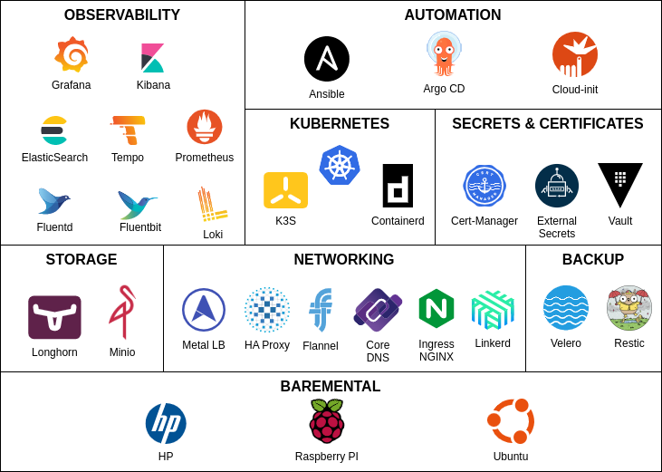

# Raspberry Pi Kubernetes Cluster 

<table>
  <tr>
    <td></td>
    <td></td>
  </tr>
</table>

## **K3S Kubernetes Cluster using bare metal ARM-based nodes (Raspberry-PIs) automated with Ansible and managed with ArgoCD**

This is an educational project to explore kubernetes cluster configurations using an ARM architecture and apply IaC (Infrastructure as Code) and GitOps methodologies to automate its provisioning and management.

The entire process for creating this cluster at home, from cluster design and architecture to step-by-step manual configuration guides, has been documented and it is published in the project website: https://picluster.ricsanfre.com.

This repository contains all source code used to automate all manual tasks described in the documentation: Cloud-init's configuration files, Ansible's source code (playbooks/roles), and packaged Kubernetes applications (helm and kustomize) to be deployed using ArgoCD. 

Since its deployment is completely automated, the cluster can be re-deployed in minutes as many times as needed for testing new cluster configurations, new software versions or just take you out of any mesh you could cause playing with the cluster.

## Scope

Automatically deploy and configure a lightweight Kubernetes flavor based on [K3S](https://k3s.io/) and deploy cluster basic services such as: 1) distributed block storage for POD's persistent volumes, [LongHorn](https://longhorn.io/), 2) backup/restore solution for the cluster, [Velero](https://velero.io/) and [Restic](https://restic.net/), 3) service mesh architecture, [Linkerd](https://linkerd.io/), and 4) observability platform based on metrics monitoring solution, [Prometheus](https://prometheus.io/), logging and analytics solution, EFḰ+LG stack ([Elasticsearch](https://www.elastic.co/elasticsearch/)-[Fluentd](https://www.fluentd.org/)/[Fluentbit](https://fluentbit.io/)-[Kibana](https://www.elastic.co/kibana/) + [Loki](https://grafana.com/oss/loki/)-[Grafana](https://grafana.com/oss/grafana/)), and distributed tracing solution, [Tempo](https://grafana.com/oss/tempo/).

The following picture shows the set of opensource solutions used so far in the cluster, which installation process has been documented and its deployment has been automated with Ansible/ ArgoCD:

  

## Cluster architecture and hardware

Home lab architecture, showed in the picture below, consist of a Kubernetes cluster of 5 nodes (1 master and 4 workers) and a firewall, built with another Raspberry PI, to isolate cluster network from your home network.

  

See further details about the architecture and hardware in the [documentation](https://picluster.ricsanfre.com/docs/home/)

## Official Site

You can browse more information about Pi Cluster Project on https://picluster.ricsanfre.com/. 

The content of this website and the source code to build it (Jekyll static based website) are also stored in this repo: `/docs` folder.

## Usage 

Check out the documentation [Quick Start guide](http://picluster.ricsanfre.com/docs/ansible/) to know how to use and tweak cloud-init files (`/cloud-init` folder), Ansible playbooks (`/ansible` folder) and packaged Kubernetes applications ( `/argocd` folder) contained in this repository, so you can use in for your own homelab.

## About the Project

This project was started in June 2021 by Ricardo Sanchez
