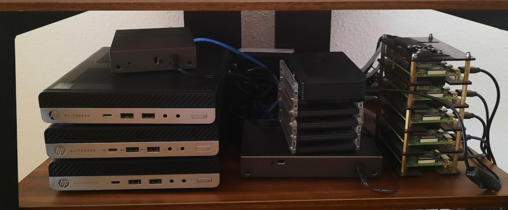
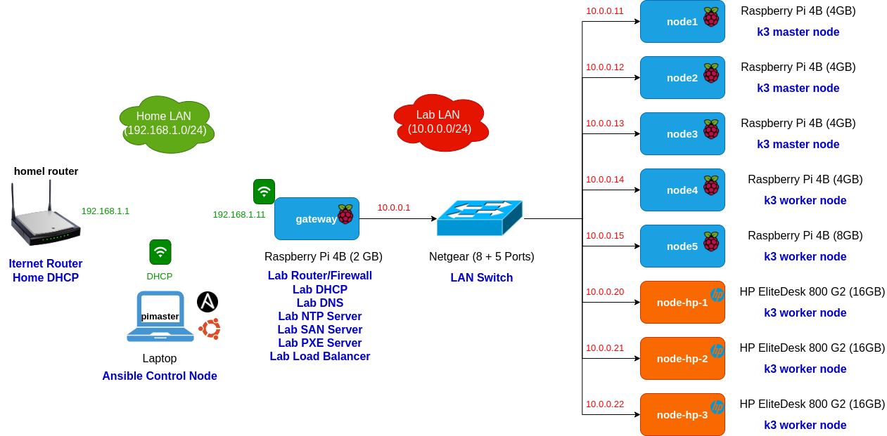

# Pi Kubernetes Cluster

<table>
  <tr>
    <td></td>
    <td></td>
  </tr>
    <td></td>
</table>

**K3S Kubernetes Cluster at home automated with Ansible and ArgoCD**

This is an educational project to build a hybrid x86/ARM Kubernetes cluster at home, using Raspberry Pi and refurbished x86 mini PCs, learn to deploy basic kubernetes services and automate its deployment and configuration applying IaC (infrastructure as a code) and GitOps methodologies.

The entire process for creating this cluster at home, from cluster design and architecture to step-by-step manual configuration guides, has been documented and it is published in the project website: https://picluster.ricsanfre.com.

This repository contains all source code used to automate all manual tasks described in the documentation: Cloud-init's configuration files, Ansible's source code (playbooks/roles), and packaged Kubernetes applications (helm and kustomize) to be deployed using ArgoCD. 

Since its deployment is completely automated, the cluster can be re-deployed in minutes as many times as needed for testing new cluster configurations, new software versions or just take you out of any mesh you could cause playing with the cluster.

## Scope

The scope of this project is to build a hybrid x86/ARM kubernetes cluster at home, using low cost Raspeberry PIs and old refurbished mini PCs, and automate its deployment and configuration applying **IaC (infrastructure as a code)** and **GitOps** methodologies with tools like [Ansible](https://docs.ansible.com/), [cloud-init](https://cloudinit.readthedocs.io/en/latest/) and [Argo CD](https://argo-cd.readthedocs.io/en/stable/).

As part of the project, the goal is to use a lightweight Kubernetes flavor based on [K3S](https://k3s.io/) and deploy cluster basic services such as: 1) distributed block storage for POD's persistent volumes, [LongHorn](https://longhorn.io/), 2) backup/restore solution for the cluster, [Velero](https://velero.io/) and [Restic](https://restic.net/), 3) service mesh architecture, [Linkerd](https://linkerd.io/), and 4) observability platform based on metrics monitoring solution, [Prometheus](https://prometheus.io/), logging and analytics solution, EFK+LG stack ([Elasticsearch](https://www.elastic.co/elasticsearch/)-[Fluentd](https://www.fluentd.org/)/[Fluentbit](https://fluentbit.io/)-[Kibana](https://www.elastic.co/kibana/) + [Loki](https://grafana.com/oss/loki/)-[Grafana](https://grafana.com/oss/grafana/)), and distributed tracing solution, [Tempo](https://grafana.com/oss/tempo/).

## Technology Stack

The following picture shows the set of opensource solutions used so far in the cluster, which installation process has been documented and its deployment has been automated with Ansible/ArgoCD:

  

<table class="table table-white table-borderer border-dark w-auto align-middle">
    <tr>
        <th></th>
        <th>Name</th>
        <th>Description</th>
    </tr>
    <tr>
        <td></td>
        <td><a href="https://www.ansible.com">Ansible</a></td>
        <td>Automate OS configuration, external services installation and k3s installation and bootstrapping</td>
    </tr>
    <tr>
        <td></td>
        <td><a href="https://argoproj.github.io/cd">ArgoCD</a></td>
        <td>GitOps tool for deploying applications to Kubernetes</td>
    </tr>
    <tr>
        <td></td>
        <td><a href="https://cloudinit.readthedocs.io/en/latest/">Cloud-init</a></td>
        <td>Automate OS initial installation</td>
    </tr>
    <tr>
        <td></td>
        <td><a href="https://ubuntu.com/">Ubuntu</a></td>
        <td>Cluster nodes OS</td>
    </tr>
    <tr>
        <td></td>
        <td><a href="https://k3s.io/">K3S</a></td>
        <td>Lightweight distribution of Kubernetes</td>
    </tr>
    <tr>
        <td></td>
        <td><a href="https://containerd.io/">containerd</a></td>
        <td>Container runtime integrated with K3S</td>
    </tr>
    <tr>
        <td></td>
        <td><a href="https://github.com/flannel-io/flannel">Flannel</a></td>
        <td>Kubernetes Networking (CNI) integrated with K3S</td>
    </tr>
    <tr>
        <td></td>
        <td><a href="https://coredns.io/">CoreDNS</a></td>
        <td>Kubernetes DNS</td>
    </tr>
    <tr>
        <td></td>
        <td><a href="https://www.haproxy.org/">HA Proxy</a></td>
        <td>Kubernetes API Load-balancer</td>
    </tr>
    <tr>
        <td></td>
        <td><a href="https://metallb.universe.tf/">Metal LB</a></td>
        <td>Load-balancer implementation for bare metal Kubernetes clusters</td>
    </tr>
    <tr>
        <td></td>
        <td><a href="https://kubernetes.github.io/ingress-nginx/">Ingress NGINX</a></td>
        <td>Kubernetes Ingress Controller</td>
    </tr> 
    <tr>
        <td></td>
        <td><a href="https://traefik.io/">Traefik</a></td>
        <td>Kubernetes Ingress Controller (alternative)</td>
    </tr>   
    <tr>
        <td></td>
        <td><a href="https://linkerd.io/">Linkerd</a></td>
        <td>Kubernetes Service Mesh</td>
    </tr>
    <tr>
        <td></td>
        <td><a href="https://longhorn.io/">Longhorn</a></td>
        <td>Kubernetes distributed block storage</td>
    </tr>
    <tr>
        <td></td>
        <td><a href="https://min.io/">Minio</a></td>
        <td>S3 Object Storage solution</td>
    </tr>
    <tr>
        <td></td>
        <td><a href="https://cert-manager.io">Cert-manager</a></td>
        <td>TLS Certificates management</td>
    </tr>
    <tr>
        <td></td>
        <td><a href="https://www.vaultproject.io/">Hashicorp Vault</a></td>
        <td>Secrets Management solution</td>
    </tr>
    <tr>
        <td></td>
        <td><a href="https://external-secrets.io/">External Secrets Operator</a></td>
        <td>Sync Kubernetes Secrets from Hashicorp Vault</td>
    </tr>
    <tr>
        <td></td>
        <td><a href="https://www.keycloak.org/">Keycloak</a></td>
        <td>Identity Access Management</td>
    </tr>
    <tr>
        <td></td>
        <td><a href="https://oauth2-proxy.github.io/oauth2-proxy/">OAuth2.0 Proxy</a></td>
        <td>OAuth2.0 Proxy</td>
    </tr>
    <tr>
        <td></td>
        <td><a href="https://velero.io/">Velero</a></td>
        <td>Kubernetes Backup and Restore solution</td>
    </tr>
    <tr>
        <td></td>
        <td><a href="https://restic.net/">Restic</a></td>
        <td>OS Backup and Restore solution</td>
    </tr>
    <tr>
        <td></td>
        <td><a href="https://prometheus.io/">Prometheus</a></td>
        <td>Metrics monitoring and alerting</td>
    </tr>
    <tr>
        <td></td>
        <td><a href="https://www.fluentd.org/">Fluentd</a></td>
        <td>Logs forwarding and distribution</td>
    </tr>
    <tr>
        <td></td>
        <td><a href="https://fluentbit.io/">Fluentbit</a></td>
        <td>Logs collection</td>
    </tr>
    <tr>
        <td></td>
        <td><a href="https://grafana.com/oss/loki/">Loki</a></td>
        <td>Logs aggregation</td>
    </tr>
    <tr>
        <td></td>
        <td><a href="https://www.elastic.co/elasticsearch/">Elasticsearch</a></td>
        <td>Logs analytics</td>
    </tr>
    <tr>
        <td></td>
        <td><a href="https://www.elastic.co/kibana/">Kibana</a></td>
        <td>Logs analytics Dashboards</td>
    </tr>
    <tr>
        <td></td>
        <td><a href="https://grafana.com/oss/tempo/">Tempo</a></td>
        <td>Distributed tracing monitoring</td>
    </tr>
    <tr>
        <td></td>
        <td><a href="https://grafana.com/oss/grafana/">Grafana</a></td>
        <td>Monitoring Dashboards</td>
    </tr>
</table>

## External Resources and Services

Even whe the premise is to deploy all services in the kubernetes cluster, there is still a need for a few external services/resources. Below is a list of external resources/services and why we need them.

### Cloud external services

|  |Provider | Resource | Purpose |
| --- | --- | --- | --- |
| | [Letsencrypt](https://letsencrypt.org/) | TLS CA Authority | Signed valid TLS certificates |
|  |[IONOS](https://www.ionos.es/) | DNS | DNS and [DNS-01 challenge](https://letsencrypt.org/docs/challenge-types/#dns-01-challenge) for certificates |

> **NOTE:** These resources are optional, the homelab still works without them but it won't have trusted certificates

**Alternatives:**

1. Use a private PKI (custom CA to sign certificates).

   Currently supported. Only minor changes are required. See details in [Doc: Quick Start instructions](https://picluster.ricsanfre.com/docs/ansible).

2. Use other DNS provider.

   Cert-manager / Certbot, which are the tools that automatically obtain certificates from Let's Encrypt, can be configured to use other DNS providers. It will need further modifications in the way cert-manager application is deployed (new providers and/or webhooks/plugins might be required).

   Currently only acme issuer (letsencytp) using IONOS as dns-01 challenge provider is configured. Check list of [supported dns01 providers](https://cert-manager.io/docs/configuration/acme/dns01/#supported-dns01-providers).

### Self-hosted external services 

There is another list of services that I have decided to run outside the kuberentes cluster selfhosting them..

|  |External Service | Resource | Purpose |
| --- | --- | --- | --- |
|  |[Minio](https://mini.io) | S3 Object Store | Cluster Backup  |
|  |[Hashicorp Vault](https://www.vaultproject.io/) | Secrets Management | Cluster secrets management |

Minio backup servive is hosted in a VM running in Public Cloud, using [Oracle Cloud Infrastructure (OCI) free tier](https://www.oracle.com/es/cloud/free/).

Vault service is running in `gateway` node, since Vault kubernetes authentication method need access to Kuberentes API, I won't host Vault service in Public Cloud.

## Cluster architecture and hardware

Home lab architecture, showed in the picture below, consist of a Kubernetes cluster of ARM (Rasbperry PI) and x86 (HP elitedesk 800 G3 mini PCs) nodes and a firewall, built with another Raspberry PI, to isolate cluster network from your home network.

  

See further details about the architecture and hardware in the [documentation](https://picluster.ricsanfre.com/docs/home/)

## Official Site

You can browse more information about Pi Cluster Project on https://picluster.ricsanfre.com/. 

The content of this website and the source code to build it (Jekyll static based website) are also stored in this repo: `/docs` folder.

## Usage 

Check out the documentation [Quick Start guide](http://picluster.ricsanfre.com/docs/ansible/) to know how to use and tweak cloud-init files (`/cloud-init` folder), Ansible playbooks (`/ansible` folder) and packaged Kubernetes applications ( `/argocd` folder) contained in this repository, so you can use in for your own homelab.

## About the Project

This project was started in June 2021 by Ricardo Sanchez
