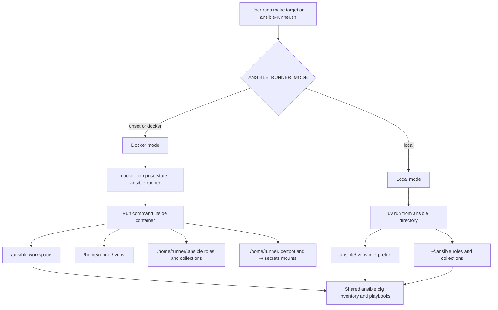

# Ansible Dual Execution Environment (Local + Docker)

This repository supports two ways to run Ansible commands using the same playbooks, inventory, and configuration:

- **Docker mode** (default): commands run inside the `ansible-runner` container.
- **Local mode**: commands run in the local UV environment under `ansible/.venv`.

## Design Rationale

The dual execution environment addresses two competing needs:

- **Reproducibility & CI parity**: The Docker container guarantees that every operator, CI pipeline, and environment runs the exact same Ansible version, Python interpreter, system packages, and CLI tools. This eliminates "works on my machine" issues during cluster operations.

- **Fast local iteration**: Full container rebuilds are too slow for day-to-day development. Local mode runs commands directly on the host using `uv`, providing sub-second startup for lint/syntax loops while still sharing the same playbooks, inventory, and configuration as the container.

A single wrapper script (`ansible-runner.sh`) selects between modes based on the `ANSIBLE_RUNNER_MODE` environment variable, so both workflows use identical invocation syntax.

Both modes use the same:

- `ansible/ansible.cfg`
- `ansible/inventory.yml`
- playbooks under `ansible/*.yml`
- Galaxy requirements from `ansible/requirements.yml`

---

## Execution Flow Diagram



---

## 1) How mode selection works

Execution mode is controlled by `ANSIBLE_RUNNER_MODE` in `ansible-runner/ansible-runner.sh`.

- If unset, mode defaults to `docker`.
- If set to `local`, the wrapper runs `uv run ...` from `ansible/`.

Examples:

```bash
# Default (docker)
make lint-ci

# One command in local mode
ANSIBLE_RUNNER_MODE=local make lint-ci

# Session-wide local mode
export ANSIBLE_RUNNER_MODE=local
```

---

## 2) Required local directories

Before first run, create the host directories used by `ansible-runner/docker-compose.yaml`:

```bash
mkdir -p \
  ~/.secrets \
  ~/.kube \
  ~/.certbot/log \
  ~/.certbot/config \
  ~/.certbot/work
```

Notes:

- `~/.ssh/id_rsa` and `~/.ssh/id_rsa.pub` are mounted read-only as individual files and should already exist on most systems.
- `~/.secrets` is used for files like `vault.env` and provider credentials.
- `metal/x86/pxe-files` is mounted to `/metal/x86/pxe-files` for PXE-based node provisioning.
- Certbot state is stored under `~/.certbot/*` and mounted to `/home/runner/.certbot/*` in the container.

Optional (local mode prep):

```bash
mkdir -p ~/.ansible/roles ~/.ansible/collections
```

---

## 3) Local mode (UV)

### Bootstrap local environment

```bash
make ansible-local-setup
```

This does:

1. `uv sync --frozen` in `ansible/`
2. Installs Galaxy roles/collections from `ansible/requirements.yml`

Galaxy install destinations in local mode:

- `~/.ansible/roles`
- `~/.ansible/collections`

### Useful local commands

```bash
make ansible-local-lint
make ansible-local-syntax-check-external-services
```

---

## 4) UV project creation and Python dependencies

The Python toolchain for Ansible is managed as a UV project in `ansible/`.

### UV project files

- `ansible/pyproject.toml`: source of truth for Python dependencies.
- `ansible/uv.lock`: fully resolved, pinned dependency graph used for reproducible installs.
- `ansible/.python-version`: target Python version (`3.14`).

### Dependency workflow

Use this workflow when adding or updating Python packages:

```bash
cd ansible
uv add <package>
uv lock
uv sync --frozen
```

Commit both files after dependency changes:

- `ansible/pyproject.toml`
- `ansible/uv.lock`

### Notes about requirements files

- Python dependencies are no longer managed through `requirements.txt` in the runner build context.
- The old files under `ansible-runner/build/` are intentionally removed.
- Ansible Galaxy content is still managed separately via `ansible/requirements.yml`.

---

## 5) Docker mode (default)

### Bootstrap runner

```bash
make ansible-runner-setup
```

This builds and starts `ansible-runner` via `ansible-runner/docker-compose.yaml`.

### Runtime mounts (container)

- `ansible/` -> `/ansible`
- `kubernetes/` -> `/kubernetes`
- `terraform/` -> `/terraform`
- `metal/x86/pxe-files` -> `/metal/x86/pxe-files`

### Image build

The Docker image is built via a multi-stage `Dockerfile` that copies versioned CLI tools from their official images:

- **kubectl** from `alpine/kubectl`
- **helm** from `alpine/helm`
- **tofu** from `ghcr.io/opentofu/opentofu`
- **uv** from `ghcr.io/astral-sh/uv`

This approach keeps tool versions pinned at build time (visible in the `Dockerfile` `FROM` lines) and eliminates the need for separate version-tracking files.

### In-image runtime layout

- UV environment: `/home/runner/.venv`
- Galaxy roles: `/home/runner/.ansible/roles`
- Galaxy collections: `/home/runner/.ansible/collections`
- Working directory: `/ansible`

### Useful docker-mode commands

```bash
make lint-ci
make syntax-check-external-services
```

---

## 6) Command matrix

| Task | Local mode | Docker mode |
|---|---|---|
| Setup env | `make ansible-local-setup` | `make ansible-runner-setup` |
| YAML lint | `make ansible-local-lint` | `make lint-ci` |
| Syntax check | `make ansible-local-syntax-check-external-services` | `make syntax-check-external-services` |
| Lockfile check | `make uv-lock-check` | `make uv-lock-check` |
| Terraform validate | — | `./ansible-runner/ansible-runner.sh bash -lc 'cd /terraform/<module> && tofu init -backend=false && tofu validate && tofu fmt -check'` |
| Ad-hoc command | `ANSIBLE_RUNNER_MODE=local ./ansible-runner/ansible-runner.sh ansible-playbook --version` | `./ansible-runner/ansible-runner.sh ansible-playbook --version` |

---

## 7) Configuration notes

- `ansible/ansible.cfg` is shared by both modes.
- `roles_path` includes `~/.ansible/roles` and `./roles`.
- `collections_path` includes `~/.ansible/collections` and `./collections`.
- Local lint tooling excludes `.venv` in:
  - `ansible/.yamllint`
  - `ansible/.ansible-lint`

---

## 8) Troubleshooting

### `ansible-playbook: command not found` in docker mode

Rebuild and recreate runner image/container:

```bash
cd ansible-runner
docker compose build
docker compose up -d
```

### Galaxy role/collection not found

Re-run setup in selected mode:

```bash
# Local
make ansible-local-setup

# Docker
make ansible-runner-setup
```

### Dependency drift between `pyproject.toml` and lock

```bash
make uv-lock-check
```

---

## 9) Recommended daily workflow

- Use **Docker mode** for CI parity and infra operations.
- Use **Local mode** for quick iteration and local lint/syntax loops.
- Before PRs, always run:

```bash
make lint-ci
make syntax-check-external-services
```
