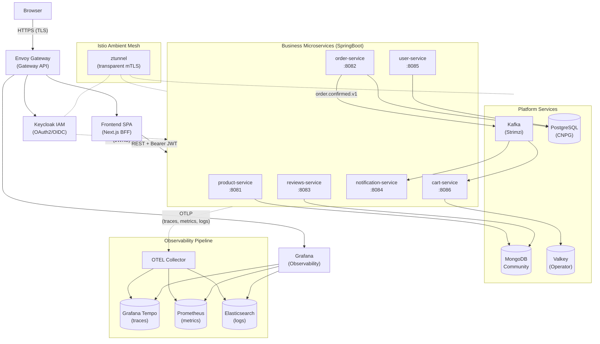
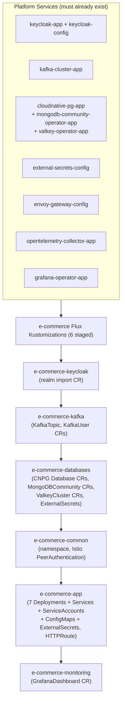

# E-Commerce Observability Demo — Architecture & Deployment

**Date:** July 2026
**Status:** Deployed as of release v1.12
**Source repository:** [github.com/ricsanfre/spring-microservices-otel-k8s](https://github.com/ricsanfre/spring-microservices-otel-k8s)

---

## Purpose

The e-commerce demo application illustrates distributed application architecture patterns in Kubernetes, showcasing how the cluster's platform services work together across five domains: databases (SQL, NoSQL, in-memory), asynchronous messaging, authentication & authorization (OAuth2/OIDC), secure service-to-service communication (Service Mesh), and observability (OpenTelemetry).

---

## Application Architecture

The platform uses a Kubernetes-native microservice design with **Envoy Gateway** as the external entry point. The frontend (Next.js BFF) is the only service exposed externally. All business microservices remain internal, communicating via Kubernetes Service DNS with kube-proxy load balancing.



### Service Details

| Service | Port | Storage | Description |
|---------|------|---------|-------------|
| **frontend-service** | 3001 | Stateless | Next.js 16 BFF with Auth.js v5. JWT never touches the browser; HttpOnly cookie session. |
| **product-service** | 8081 | MongoDB | Product catalog. Read endpoints public, write requires `SCOPE_products:write`. |
| **order-service** | 8082 | PostgreSQL | Full order lifecycle. Publishes `order.confirmed.v1` to Kafka on confirmation. |
| **reviews-service** | 8083 | MongoDB | Product reviews. Validates that user has a delivered order for the product. |
| **notification-service** | 8084 | Stateless | Pure Kafka consumer. Dispatches notifications on order events. |
| **user-service** | 8085 | PostgreSQL | User profiles. Lazy registration with `idp_subject` linking to Keycloak. |
| **cart-service** | 8086 | Valkey | Shopping cart with 7-day TTL. Two-phase checkout with Kafka-based cart clearing. |

### Security Model

All HTTP requests carry signed JWTs validated independently by each resource server using Keycloak's JWKS public keys. No service stores user passwords.

- **User authentication**: Authorization Code flow via Next.js BFF — browser receives HttpOnly cookie, never sees JWT.
- **Service-to-service**: Client Credentials flow — each microservice obtains a service-account JWT from Keycloak.
- **M2M passthrough**: When cart-service calls order-service with a service-account token (no real user), it supplies the resolved `userId` in the request body.

Keycloak uses `hostname.backchannelDynamic: true` to serve internal URLs for server-side token exchange while keeping the `issuer` claim as the external hostname.

### Async Messaging

Single Kafka topic `order.confirmed.v1` — produced by order-service, consumed by notification-service and cart-service. Cart clearing is decoupled via Kafka, avoiding circular dependency with order-service.

### Data Models

| Backend | Data | Key details |
|---------|------|-------------|
| **PostgreSQL** | Orders, Users | CNPG Cluster with 1 primary + 1 replica. Flyway migrations at startup. |
| **MongoDB** | Products, Reviews | Community Operator. Seed job pre-loads sample product catalog. |
| **Valkey** | Cart | JSON blobs, 7-day TTL, keyed by `cart:{userId}`. |

### Observability Pipeline

All services export OTLP traces, metrics, and logs via the Spring Boot Starter for OpenTelemetry:

| Signal | Backend | Integration |
|--------|---------|-------------|
| Traces | Grafana Tempo | W3C TraceContext propagation |
| Logs | Elasticsearch | Logback OpenTelemetryAppender (trace-id correlated) |
| Metrics | Prometheus | Micrometer via OTLP HTTP exporter |

---

## Deployment in Pi Cluster

The application is deployed via FluxCD GitOps as an **application workload** (not a platform service). It depends on platform services already provisioned by the cluster bootstrap.

### FluxCD Dependency Chain




### Namespace Layout

All business services run in the `e-commerce` namespace. Configuration resources are deployed to the target service's namespace:

| Namespace | Resources |
|-----------|-----------|
| `e-commerce` | 7 microservices, HTTPRoute, ServiceAccounts, Istio PeerAuthentication, GrafanaDashboard |
| `keycloak` | Realm import CR, OIDC client secrets (ExternalSecret) |
| `kafka` | `KafkaTopic` (order.confirmed.v1), `KafkaUser` CRs (7 service accounts) |
| `databases` | PostgreSQL Databases, MongoDBCommunity CRs, ValkeyCluster CR, connection credentials (ExternalSecret) |

### Platform Service Integration

Each cluster platform service is consumed as follows:

| Platform Service | How the demo consumes it |
|------------------|--------------------------|
| **Envoy Gateway** | `HTTPRoute` for `app.${CLUSTER_DOMAIN}` → frontend-service. TLS terminated at the shared Envoy Gateway listener. |
| **Keycloak** | Realm `e-commerce` with 7 confidential clients. Realm import CR provisions clients on cluster bootstrap. Client secrets stored in Vault and synced via External Secrets Operator. |
| **Kafka (Strimzi)** | `KafkaTopic` and `KafkaUser` CRs create the `order.confirmed.v1` topic and 7 SCRAM-authenticated service accounts. Credentials flow: Vault → ExternalSecret → KafkaUser. |
| **PostgreSQL (CNPG)** | `Database` CRs create `orders_db` and `users_db`. Connection credentials flow: Vault → ExternalSecret → Deployment env. Flyway runs schema migrations at startup. |
| **MongoDB (Community Operator)** | `MongoDBCommunity` CR provisions a 3-replica set. Init job seeds product catalog. Connection credentials via Vault → ExternalSecret. |
| **Valkey (Valkey Operator)** | `ValkeyCluster` CR for cart data. Connection credentials via Vault → ExternalSecret. |
| **Istio Ambient Mesh** | Namespace labeled for ambient mesh. `PeerAuthentication` in PERMISSIVE mode allows Prometheus scraping of metrics ports. ztunnel provides transparent mTLS between all services. |
| **OpenTelemetry Collector** | All services export OTLP to `otel-collector.observability.svc`. Collector fans out to Tempo, Prometheus, and Elasticsearch. |
| **Grafana Operator** | `GrafanaDashboard` CR deploys the e-commerce APM dashboard. |
| **External Secrets Operator** | `ExternalSecret` resources in each namespace sync credentials from Vault (`secret/e-commerce/*`) to Kubernetes Secrets. |
| **cert-manager** | TLS certificate for `app.${CLUSTER_DOMAIN}` managed by the shared cert-manager ClusterIssuer. |

### Configuration Pattern

All service configuration follows the same pattern:

```
kubernetes/apps/e-commerce/
├── <service>/
│   ├── base/
│   │   ├── deployment.yaml        ← image, ports, env from ConfigMap + Secret
│   │   ├── service.yaml           ← ClusterIP
│   │   ├── configmap.yaml         ← non-sensitive config (DB hosts, OTEL endpoint)
│   │   ├── external-secrets.yaml  ← Vault → K8s Secret (DB passwords, OAuth2 client secrets)
│   │   ├── serviceaccount.yaml    ← IRSA-style service account
│   │   └── kustomization.yaml
│   └── overlays/prod/
│       └── kustomization.yaml     ← patches (resource limits, affinity, image tag)
├── config/
│   ├── databases/                 ← shared database CRs
│   ├── kafka/                     ← KafkaTopic + KafkaUser CRs
│   ├── keycloak/                  ← Keycloak realm import CR
│   ├── common/                    ← namespace, Istio labels
│   └── monitoring/                ← GrafanaDashboard
└── app/
    ├── base/kustomization.yaml    ← aggregates all 7 services
    └── overlays/prod/
```

Secrets follow the Vault naming convention `secret/e-commerce/<service>` and are synced by ExternalSecret resources. Each service's `ServiceAccount` is annotated for IRSA-style workload identity where needed.

---

## Comparison: Upstream k3d vs Pi Cluster

| Dimension | Upstream (k3d staging) | Pi Cluster (production) |
|-----------|------------------------|--------------------------|
| **Cluster type** | k3d (Docker-based) | K3s on bare metal (ARM + x86) |
| **Ingress** | Envoy Gateway (app-level) | Envoy Gateway (platform-level, shared) |
| **GitOps** | Flux CD | Flux CD |
| **TLS** | cert-manager self-signed wildcard | cert-manager Let's Encrypt (IONOS DNS01) |
| **Databases** | Dedicated per-app instances | Shared `databases` namespace with anti-affinity rules |
| **Kafka** | Dedicated Strimzi cluster | Shared Strimzi cluster with SCRAM-SHA-512 auth |
| **Keycloak** | Dedicated instance | Shared cluster instance, realm via Terraform |
| **Secrets** | Fake ExternalSecret store | HashiCorp Vault + External Secrets Operator |
| **mTLS** | Not configured | Istio ambient mesh (transparent, no sidecars) |
| **Observability** | OTEL Operator + dedicated backends | Shared OTEL Collector + cluster-wide Tempo/Prometheus/Elasticsearch |
| **Dashboards** | Grafana Helm values | Grafana Operator CRDs |
| **Scheduling** | Any node | Prefer amd64 nodes (anti-affinity rules) |

---

## Related Documents

- [Application source repository](https://github.com/ricsanfre/spring-microservices-otel-k8s) — upstream architecture, ADRs, CI/CD
- [Internal Services Terraform Configuration](internal-services-terraform-configuration.md) — Keycloak and Elastic configuration via Tofu Controller
- [External Services Terraform Configuration](external-services-terraform-configuration.md) — Vault and RustFS Ansible+Terraform pattern
- [Observability Architecture](/docs/observability/) — Dual OpenTelemetry + traditional collection architecture
