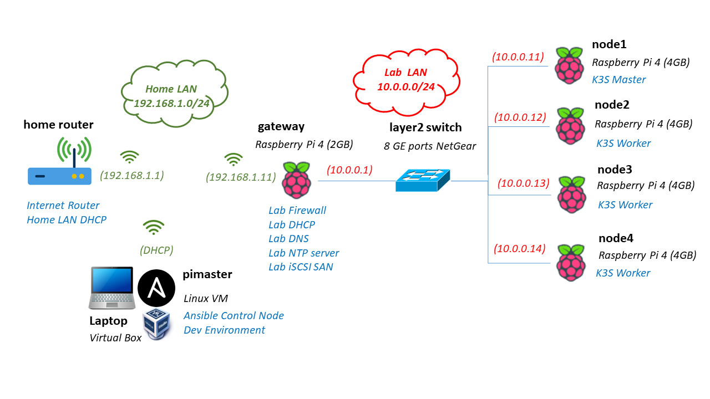
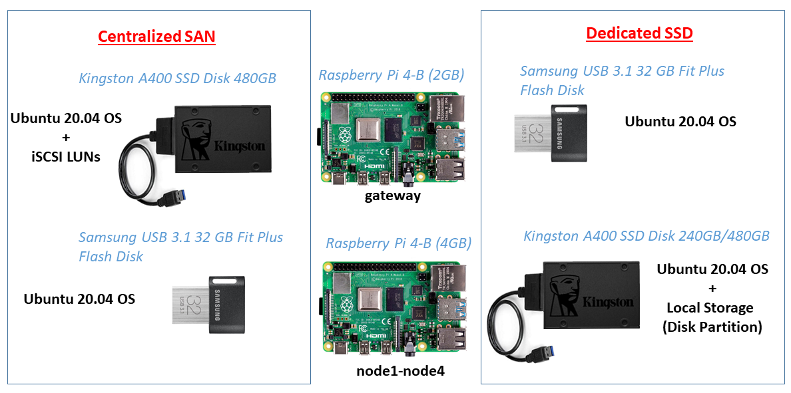

# Lab Architecture and Hardware used

## Lab Architecture

The home lab I am building is shown in the following picture

## Networking

A Raspberry Pi cluster composed of 4 Raspberry Pi 4 (4GB), `node1-node4` will be connected using a LAN Switch. To isolate lab network from my home network, a Raspberry PI 4 (2GB), `gateway` will be used as Router/Firewall of the lab network. It will also provide networking sercices: Internet Access, DNS, NTP and DHCP services to my lab network. `gateway` will be connected to my home network using its WIFI interface and to the LAN Switch using the eth interface.

## Storage

`node1-node4` will use local storage attached directly to USB 3.0 port (USB Flash Disk) for hosting the OS, avoiding the use of less reliable SDCards.

Additional storage is required per node for deploying the Kubernetes distributed storage solution (Ceph or Longhorn).

iSCSI SAN will be deployed instead of attaching an additional USB Flash Disks to each of the nodes because, first, I wanted to test the different storage options for RaspberryPI and to learn about iSCSI configuration and deployment on bare-metal environments, and second, deploying a centralized storage solution was cheaper than installing additional USB Flash Disks.

After testing the performance of the different storage options for the Raspberry Pi, the performace obtained using local attached USB3.0 Flash Disk is quite simillar to the one obtained using iSCSI with a SSD Disk as central storage). See this [repository](https://github.com/ricsanfre/pi-storage-benchmark) for the details of the testing procedure and the results.

A SAN (Storage Access Network) will be configured using `gateway` as iSCSI Storage Server, providing additional storage (LUNs) to `node1-node4`.
As storage device, a SSD disk will be attached to `gateway` node. This SSD disk will be used as well to host the OS.

## Hardware used

This is the hardware I'm using to create the cluster:

- [4 x Raspberry Pi 4 - Model B (4 GB)](https://www.tiendatec.es/raspberry-pi/gama-raspberry-pi/1100-raspberry-pi-4-modelo-b-4gb-765756931182.html) for the kuberenetes cluster (1 master node and 3 workers).
- [1 x Raspberry Pi 4 - Model B (2 GB)](https://www.tiendatec.es/raspberry-pi/gama-raspberry-pi/1099-raspberry-pi-4-modelo-b-2gb-765756931175.html) for creating a router for the lab environment connected via wifi to my home network and securing the access to my lab network.
- [4 x SanDisk Ultra 32 GB microSDHC Memory Cards](https://www.amazon.es/SanDisk-SDSQUA4-064G-GN6MA-microSDXC-Adaptador-Rendimiento-dp-B08GY9NYRM/dp/B08GY9NYRM) (Class 10) for installing Raspberry Pi OS for enabling booting from USB (update Raspberry PI firmware and modify USB partition)
- [4 x Samsung USB 3.1 32 GB Fit Plus Flash Disk](https://www.amazon.es/Samsung-FIT-Plus-Memoria-MUF-32AB/dp/B07HPWKS3C) for booting `node1-node4` from USB (Ubuntu 20.04 OS). 
- [1 x Kingston A400 SSD Disk 480GB](https://www.amazon.es/Kingston-SSD-A400-Disco-s%C3%B3lido/dp/B01N0TQPQB) and [1 x Startech USB 3.0 to SATA III Adapter](https://www.amazon.es/Startech-USB3S2SAT3CB-Adaptador-3-0-2-5-negro) for booting `gateway` from USB/SSD (Ubuntu 20.04).
- [1 x GeeekPi Pi Rack Case](https://www.amazon.es/GeeekPi-Raspberry-Ventilador-refrigeraci%C3%B3n-disipador/dp/B07Z4GRQGH/ref=sr_1_11). It comes with a stack for 4 x Raspberry Pi’s, plus heatsinks and fans)
- [1 x Negear GS108-300PES](https://www.amazon.es/Netgear-GS108E-300PES-conmutador-gestionable-met%C3%A1lica/dp/B00MYYTP3S). 8 ports GE ethernet manageable switch (QoS and VLAN support)
- [1 x ANIDEES AI CHARGER 6+](https://www.tiendatec.es/raspberry-pi/raspberry-pi-alimentacion/796-anidees-ai-charger-6-cargador-usb-6-puertos-5v-60w-12a-raspberry-pi-4712909320214.html). 6 port USB power supply (60 W and max 12 A)
- [5 x Ethernet Cable](https://www.amazon.es/NANOCABLE-10-20-0400-BL-Ethernet-latiguillo-0-5mts/dp/B00YAFOB60). Cat 6 0.5 meter length
- [5 x USB-C power cable](https://www.amazon.es/NIBIKIA-Android-Cargador-Compatible-Motorola/dp/B08FFVCNZM). 0.5 m long.

