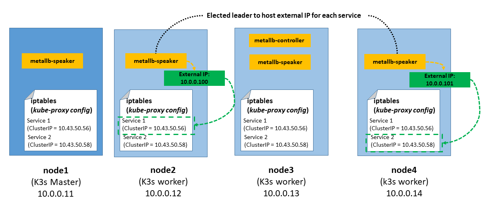

# K3S Networking

> **NOTE**: Basic kubernetes networking concepts and useful references can be found [here](./k8s_networking_basics.md) 

## K3S networking default add-ons

By default K3s install and configure basic Kubernetes networking packages:

- [Flannel](https://github.com/flannel-io/flannel) as Networking plugin, CNI (Container Networking Interface), for enabling pod communications
- [CoreDNS](https://coredns.io/) providing cluster dns services
- [Traefik](https://traefik.io/) as ingress controller
- [Klipper Load Balancer](https://github.com/k3s-io/klipper-lb) as embedded Service Load Balancer


# Flannel as CNI

TBD

# Traefik as Ingress Controller

Traefik is a modern HTTP reverse proxy and load balancer made to deploy microservices with ease. It simplifies networking complexity while designing, deploying, and running applications.

# Metal LB as Cluster Load Balancer

Instead of using the embeded service load balancer that only comes with K3S, a more generic kubernetes load balancer like [Metal LB](https://metallb.universe.tf/) will be used. This load balancer can be used with almost any distribution of kubernetes.

In order to use Metal LB, K3S embedded Klipper Load Balancer must be disabled: K3s server installation  option `--disable servicelb`.

K3S fresh installation (disabling embedded service load balanced) the following pods and services are started by default:

```
kubectl get pods --all-namespaces
NAMESPACE     NAME                                      READY   STATUS      RESTARTS   AGE
kube-system   metrics-server-86cbb8457f-k52mz           1/1     Running     0          7m45s
kube-system   local-path-provisioner-5ff76fc89d-qzfpp   1/1     Running     0          7m45s
kube-system   coredns-7448499f4d-wk4sd                  1/1     Running     0          7m45s
kube-system   helm-install-traefik-crd-5r72x            0/1     Completed   0          7m46s
kube-system   helm-install-traefik-86kpb                0/1     Completed   2          7m46s
kube-system   traefik-97b44b794-vtj7x                   1/1     Running     0          5m24s

kubectl get services --all-namespaces
NAMESPACE     NAME             TYPE           CLUSTER-IP      EXTERNAL-IP   PORT(S)                      AGE
default       kubernetes       ClusterIP      10.43.0.1       <none>        443/TCP                      8m32s
kube-system   kube-dns         ClusterIP      10.43.0.10      <none>        53/UDP,53/TCP,9153/TCP       8m29s
kube-system   metrics-server   ClusterIP      10.43.169.140   <none>        443/TCP                      8m28s
kube-system   traefik          LoadBalancer   10.43.50.56     <pending>     80:30582/TCP,443:30123/TCP   5m53s
```

## Why Metal LB

Kubernetes does not offer an implementation of network load balancers (Services of type LoadBalancer) for bare-metal clusters. The implementations of network load balancers that Kubernetes does ship with are all glue code that calls out to various IaaS platforms (GCP, AWS, Azure…). In bare-metal kubernetes clusters, like the one I am building, "LoadBalancer" services will remain in the “pending” state indefinitely when created.
(see in previous output of `kubectl get services` command how `traefik` LoadBAlancer service "External IP" is "pending")

For Bare-metal cluster only two optios remain availale for managing incoming traffic to the cluster: “NodePort” and “externalIPs” services. Both of these options have significant downsides for production use, which makes bare-metal clusters second-class citizens in the Kubernetes ecosystem.

MetalLB provides a network load balacer that can be integrated with standard network equipment, so that external services on bare-metal clusters can be accesible using a pool of "external" ip addresses.

## How Metal LB works

MetalLB can work in two modes, BGP and Layer 2. The major advantage of the layer 2 mode is its universality: it will work on any Ethernet network. In BGP mode specific routers are needed to deploy the solution.

In [layer 2 mode](https://metallb.universe.tf/concepts/layer2/), one node assumes the responsibility of advertising a particular kuberentes service (LoadBalance type) to the local network, this is call the `leader` node. From the network’s perspective, it simply looks like that node has multiple IP addresses assigned to its network interface and it just responds to ARP requests for IPv4 services, and NDP requests for IPv6.

When configuring MetalLB in layer 2 mode, all traffic for a service IP goes to the leader node. From there, kube-proxy spreads the traffic to all the service’s pods. Thus MetalLB layer 2 really does not implement a load balancer. Rather, it implements a failover mechanism so that a different node can take over should the current leader node fail for some reason.

MetalLB consists of two different pods:

- Controller: resposible for handling IP address assigments from a configured Pool.
- Speaker: DaemonSet pod running on each worker node, resposible for announcing the allocated IPs.





## Install Metal Load Balancer


Installation using `Helm` (Release 3):

- Step 1: Add the Metal LB Helm repository:
    ```
    helm repo add metallb https://metallb.github.io/metallb
    ```
- Step 2: Fetch the latest charts from the repository:
    ```
    helm repo update
    ```
- Step 3: Create namespace
    ```
    kubectl create namespace metallb-system
    ```
- Step 4. Create `values.yml` for configuring the installation. Metallb protocol specification and external ip address pool allocation

    ```yml
    configInline:
      address-pools:
        - name: default
            protocol: layer2
            addresses:
              - 10.0.0.100-10.0.0.200
    ```

- Step 5: Install Metallb in the metallb-system namespace.
    ```
    helm install metallb metallb/metallb --namespace metallb-system -f values.yml
    ```
- Step 6: Confirm that the deployment succeeded, run:
    ```
    kubectl -n metallb-system get pod
    ```


After a while, metallb is deployed and traefik LoadBalancer service gets its externa-ip from the configured pool and is accessible from outside the cluster

```
kubectl get services --all-namespaces
NAMESPACE     NAME             TYPE           CLUSTER-IP      EXTERNAL-IP   PORT(S)                      AGE
default       kubernetes       ClusterIP      10.43.0.1       <none>        443/TCP                      63m
kube-system   kube-dns         ClusterIP      10.43.0.10      <none>        53/UDP,53/TCP,9153/TCP       63m
kube-system   metrics-server   ClusterIP      10.43.169.140   <none>        443/TCP                      63m
kube-system   traefik          LoadBalancer   10.43.50.56     10.0.0.100    80:30582/TCP,443:30123/TCP   60m
```
