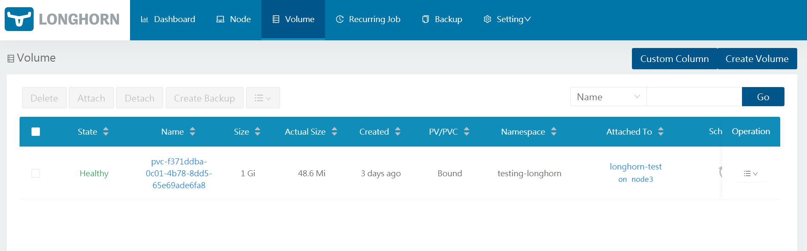

# LongHorn

K3s comes with a default [Local Path Provisioner](https://rancher.com/docs/k3s/latest/en/storage/) that allows creating a PersistentVolumeClaim backed by host-based storage. This means the volume is using storage on the host where the pod is located. If the POD need to be started on a different node it won`t be able to access the data.

A distributed block storage is needed to handle this issue. With distributed block storage, the storage is decouple from the pods, and the PersistentVolumeClaim can be mounted to the pod regardless of where the pod is running

[Longhorn](https://longhorn.io/) is a distributed block storage system for Kubernetes. Lightweight, reliable and easy-to-use can be used as an alternative to Rook/Cephs. It is opensource software initially developed by Rancher Labs supporting AMD64 and ARM64 architectures that can be easily integrated with K3S.


## LongHorn Installation


### Open-iscsi Requirement

LongHorn requires that `open-iscsi` package has been installed on all the nodes of the Kubernetes cluster, and `iscsid` daemon is running on all the nodes.

Longhorn uses internally iSCSI to expose the block device presented by the Longhorn volume to the kuberentes pods. So the iSCSI initiator need to be setup on each node. Longhorn is acting as iSCSI Target exposing Longhorn Volumes that are presented to the node by the iSCSI Initiator running on the same node as /dev/longhorn/ block devices. For implementation details see (https://github.com/longhorn/longhorn-engine).


Since all cluster nodes (`node1-node4`) have been already configured as iSCSI Initiators all pre-requisties are met.


### Installation procedure using Helm

Installation using `Helm` (Release 3):

- Step 1: Add the Longhorn Helm repository:
    ```
    helm repo add longhorn https://charts.longhorn.io
    ```
- Step2: Fetch the latest charts from the repository:
    ```
    helm repo update
    ```
- Step 3: Create namespace
    ```
    kubectl create namespace longhorn-system
    ```
- Step 3: Install Longhorn in the longhorn-system namespace, setting `/storage` as default path for storing replicas
    ```
    helm install longhorn longhorn/longhorn --namespace longhorn-system --set defaultSettings.defaultDataPath="/storage"
    ```
- Step 4: Confirm that the deployment succeeded, run:
    ```
    kubectl -n longhorn-system get pod
    ```

### Configuring acces to Longhorn UI

Create a Ingress rule to make Longhorn front-end available through the Ingress Controller (Traefik) using a specific URL (`storage.picluster.ricsanfre.com`), mapped by DNS to Traefik Load Balancer external IP.

Longhorn backend is providing not secure communications (HTTP traffic) and thus Ingress resource will be configured to enable HTTPS (Traefik TLS end-point) and redirect all HTTP traffic to HTTPS.
Since Longhorn frontend does not provide any authentication mechanism, Traefik HTTP basic authentication will be configured. 


- Step 1. Create a manifest file `longhorn_ingress.yml`

Two Ingress resources will be created, one for HTTP and other for HTTPS. Traefik middlewares, HTTPS redirect and basic authentication will be used. 

```yml
# HTTPS Ingress
apiVersion: networking.k8s.io/v1
kind: Ingress
metadata:
  name: longhorn-ingress
  namespace: longhorn-system
  annotations:
    # HTTPS as entry point
    traefik.ingress.kubernetes.io/router.entrypoints: websecure
    # Enable TLS
    traefik.ingress.kubernetes.io/router.tls: "true"
    # Use Basic Auth Midleware configured
    traefik.ingress.kubernetes.io/router.middlewares: traefik-system-basic-auth@kubernetescrd
    # Enable cert-manager to create automatically the SSL certificate and store in Secret
    cert-manager.io/cluster-issuer: self-signed-issuer
    cert-manager.io/common-name: longhorn
spec:
  tls:
  - hosts:
    - storage.picluster.ricsanfre.com
    secretName: storage-tls
  rules:
  - host: storage.picluster.ricsanfre.com
    http:
      paths:
      - path: /
        pathType: Prefix
        backend:
          service:
            name: longhorn-frontend
            port:
              number: 80

---
# http ingress for http->https redirection
kind: Ingress
apiVersion: networking.k8s.io/v1
metadata:
  name: longhorn-redirect
  namespace: longhorn-system
  annotations:
    # Use redirect Midleware configured
    traefik.ingress.kubernetes.io/router.middlewares: traefik-system-redirect@kubernetescrd
    # HTTP as entrypoint
    traefik.ingress.kubernetes.io/router.entrypoints: web
spec:
  rules:
    - host: storage.picluster.ricsanfre.com
      http:
        paths:
        - path: /
          pathType: Prefix
          backend:
            service:
              name: longhorn-frontend
              port:
                number: 80
```

- Step 2. Apply the manifest file

    kubectl apply -f longhorn_ingress.yml


### Testing Longhorn

For testing longorn storage, create a specification for a `PersistentVolumeClaim` and use the `storageClassName` of `longhorn` and a POD making use of that volume claim

- Step 1. Create testing namespace

    ```
    kubectl create namespace testing-longhorn
    ```

- Step 2. Create manifest file `longhorn_test.yml`

```yml
---
apiVersion: v1
kind: PersistentVolumeClaim
metadata:
  name: longhorn-pvc
  namespace: testing-longhorn
spec:
  accessModes:
  - ReadWriteOnce
  storageClassName: longhorn
  resources:
    requests:
      storage: 1Gi

---
apiVersion: v1
kind: Pod
metadata:
  name: longhorn-test
  namespace: testing-longhorn
spec:
  containers:
  - name: longhorn-test
    image: nginx:stable-alpine
    imagePullPolicy: IfNotPresent
    volumeMounts:
    - name: longhorn-pvc
      mountPath: /data
    ports:
    - containerPort: 80
  volumes:
  - name: longhorn-pvc
    persistentVolumeClaim:
      claimName: longhorn-pvc
```
- Step 2. Apply the manifest file

    kubectl apply -f longhorn_test.yml


> NOTE: Ansible playbook has been developed for automatically create this testing POD `roles\longhorn\test_longhorn.yml` 

- Step 3. Check created POD has been started

    kubectl get pods -o wide -n testing-longhorn

- Step 4. Check pv and pvc have been created

    kubectl get pv -n testing-longhorn
    kubectl get pvc -n testing-longhorn

- Step 5. Connect to the POD and make use of the created volume

    Get a shell to the container and create a file on the persistent volume:
    ```console
    kubectl exec -n testing-longhorn -it longhorn-test -- sh
    / # echo "testing" > /data/test.txt
    ```
- Step 6. Check in the longhorn-UI the created volumes and the replicas.




### Setting Longhorn as default Kubernetes StorageClass


By default K3S comes with Rancher’s Local Path Provisioner and this enables the ability to create persistent volume claims out of the box using local storage on the respective node.

In order to use Longhorn as default storageClass whenever a new Helm is installed, Local Path Provisioner need to be removed from default storage class.

After longhorn installation check default storage classes with command:

```
kubectl get storageclass
```

```
NAME                   PROVISIONER             RECLAIMPOLICY   VOLUMEBINDINGMODE      ALLOWVOLUMEEXPANSION   AGE
local-path (default)   rancher.io/local-path   Delete          WaitForFirstConsumer   false                  10m
longhorn (default)     driver.longhorn.io      Delete          Immediate              true                   3m27s
```

Both Local-Path and longhor are defined as default storage classes:


Remove Local path from default storage classes with the command:

```
kubectl patch storageclass local-path -p '{"metadata": {"annotations":{"storageclass.kubernetes.io/is-default-class":"false"}}}'
```

Procedure is explained in kubernetes documentation: ["Change default Storage Class"](https://kubernetes.io/docs/tasks/administer-cluster/change-default-storage-class/).